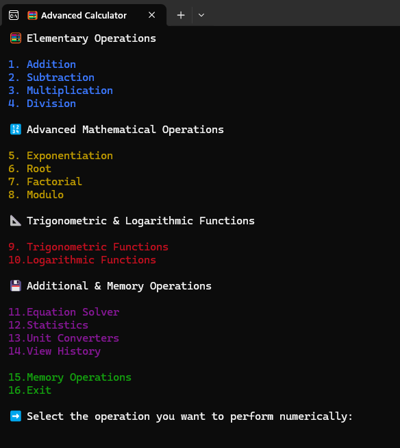
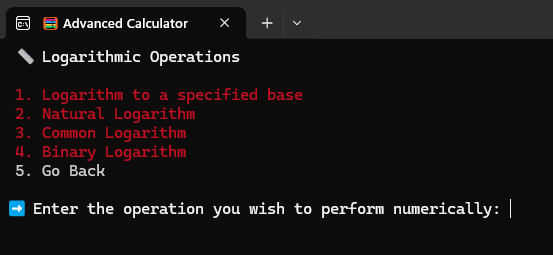
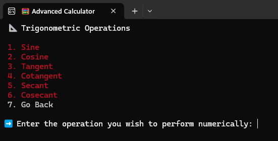
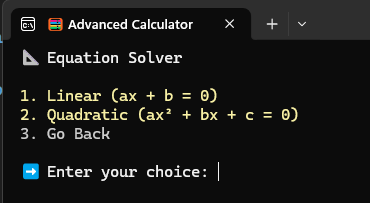
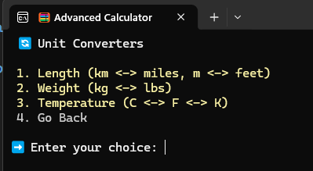
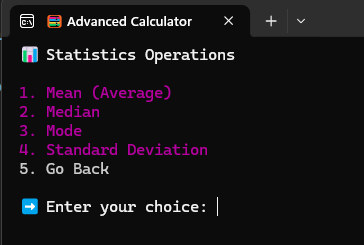
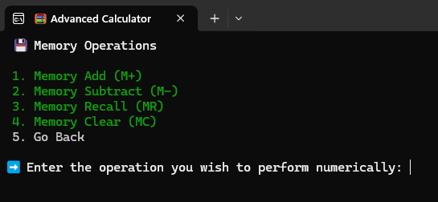
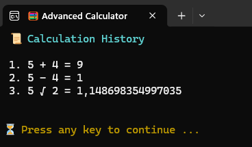

<div align="center">

# 🧮 Console-Based Advanced Calculator

[](https://docs.microsoft.com/en-us/dotnet/csharp/)
[](https://dotnet.microsoft.com/download)
[](https://opensource.org/licenses/MIT)

A feature-rich, interactive, and beautifully designed console-based calculator built entirely in C# and .NET 10.0. 
It offers much more than basic arithmetic, providing complex mathematical operations, state management, and an interactive UI right in your terminal.



</div>

---

## ✨ Key Features

This calculator is designed to provide a premium console experience with a robust set of mathematical tools.

*   **🔢 Elementary Operations**: Addition, Subtraction, Multiplication, Division.
*   **🚀 Advanced Operations**: Exponentiation, Roots, Factorial, and Modulo.
*   **📐 Trigonometry**: Sine, Cosine, Tangent, Cotangent, Secant, and Cosecant (with degree to radian conversion).
*   **📈 Logarithms**: Natural (ln), Common (log10), Binary (log2), and Custom Base logarithms.
*   **📊 Statistics**: Mean, Median, Mode, Variance, and Standard Deviation calculations on data sets.
*   **🔣 Equation Solver**: Solves Linear (ax + b = 0) and Quadratic (ax² + bx + c = 0) equations.
*   **🔄 Converters**: Length, Mass, Temperature, and Time conversions.
*   **💾 Memory Functions**: Save (M+), Subtract (M-), Recall (MR), and Clear (MC) values in memory.
*   **🔗 Operation Chaining**: Use the result of your previous calculation (`LastResult`) as the input for your next operation, seamlessly.
*   **📜 Session History**: View a complete log of all calculations performed during your session.
*   **🎨 Rich Console UI**: Enjoy a color-coded, user-friendly interface with clear error handling and input validation.

---

## 📸 Screenshots

Here is a glimpse of the different menus and features available in the application:

<div align="center">
  
| Logarithm Menu | Trigonometry Menu |
| :---: | :---: |
|  |  |

| Equation Solver | Converters |
| :---: | :---: |
|  |  |

| Statistics Menu | Memory & History |
| :---: | :---: |
|  |  |
  


</div>

---

## 🏗️ Architecture & Structure

The project follows a clean, modular architecture, separating the User Interface from the Business Logic.

```text
AdvancedCalculator/
├── Calculator/             # Main Application Project
│   ├── UI/                 # Presentation Layer
│   │   ├── Menu.cs         # Renders the various console menus
│   │   └── Symbols.cs      # Defines operation enums and identifiers
│   ├── Services/           # Business Logic Layer
│   │   ├── Elementary.cs   # Basic math operations
│   │   ├── Advanced.cs     # Complex math operations
│   │   ├── Trigonometry.cs # Trig functions
│   │   ├── Logarithm.cs    # Log functions
│   │   ├── Statistics.cs   # Statistical analysis
│   │   ├── EquationSolver.cs # Solving algebraic equations
│   │   ├── Converters.cs   # Unit conversions
│   │   ├── Memory.cs       # Memory state management (M+, M-, MR)
│   │   ├── History.cs      # Session transaction history
│   │   └── StateManager.cs # Manages global state (e.g., Last Result)
│   ├── ConsoleHelper.cs    # Robust utility for colored output and secure input
│   └── Initializer.cs      # The Entry Point (Main Method)
└── AdvancedCalculator.sln  # Solution File
```

---

## 🚀 Getting Started

Follow these instructions to get the calculator running on your local machine.

### Prerequisites

*   [.NET 10.0 SDK](https://dotnet.microsoft.com/download) (or later) installed on your machine.
*   A terminal/console emulator that supports standard ANSI colors for the best experience.

### Installation & Run

1.  **Clone the repository:**
    ```bash
    git clone https://github.com/Kaaner4mir/console-based-advanced-calculator.git
    ```
2.  **Navigate to the project directory:**
    ```bash
    cd console-based-advanced-calculator/Calculator
    ```
3.  **Run the application:**
    ```bash
    dotnet run
    ```

---

## 🤝 Contributing

Contributions, issues, and feature requests are welcome!
Feel free to check [issues page](https://github.com/Kaaner4mir/console-based-advanced-calculator/issues). 

---

## 📜 License

This project is licensed under the [MIT License](LICENSE) - see the LICENSE file for details.

<div align="center">
  <i>Made with ❤️ by Kaaner4mir</i>
</div>
